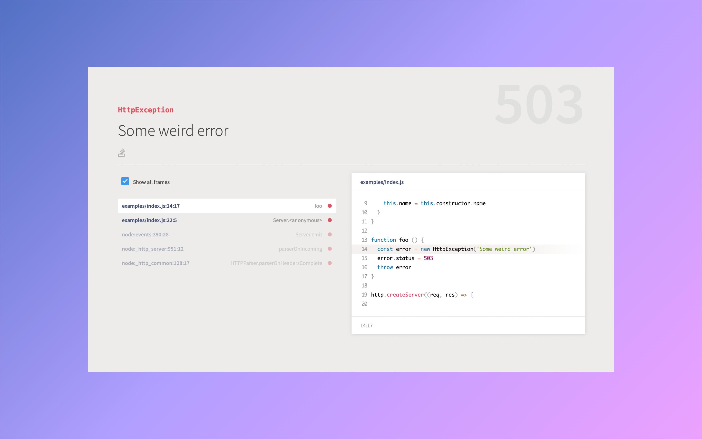

# Youch!
> Pretty error reporting for Node.js :rocket:

<br />

<p>
  <a href="youch.jpeg">
    
  </a>
</p>

<br />

---

<br />

[![NPM Version][npm-image]][npm-url]
[![Tests][gh-workflow-image]][gh-workflow-url]
[![Downloads Stats][npm-downloads-image]][npm-url]

Youch is inspired by [Whoops](https://filp.github.io/whoops) but with a modern design. Reading stack trace of the console slows you down from active development. Instead **Youch** print those errors in structured HTML to the browser.

## Features
1. HTML reporter
2. JSON reporter, if request accepts a json instead of text/html.
3. Sorted frames of error stack.
4. Support for ESM.

> Checkout [youch terminal](https://github.com/poppinss/youch-terminal) to beautify errors on terminal.

## Installation
```bash
npm i --save youch
```

## Basic Usage
Youch is used by [AdonisJs](http://adonisjs.com), but it can be used by express or raw HTTP server as well.

```javascript
const Youch = require('youch')
const http = require('http')

http.createServer(async function (req, res) {

  // PERFORM SOME ACTION
  if (error) {
    const youch = new Youch(error, req)
    const html = await youch.toHTML()

    res.writeHead(200, {'content-type': 'text/html'})
    res.write(html)
    res.end()
  }

}).listen(8000)
```

## Adding helpful links
Everytime an error occurs, we can help users we letting search for the error on Google, over even on the Github repo of our project. 

Youch let you define clickable links to redirect the user to a website with the error message.

```js
const youch = new Youch(error)

await youch
  .addLink(({ message }) => {
    const url = `https://stackoverflow.com/search?q=${encodeURIComponent(`[adonis.js] ${message}`)}`
    
    return `<a href="${url}" target="_blank" title="Search on stackoverflow">Search stackoverflow</a>`
  })
  .toHTML()
``` 

Also you can make use of [Font awesome brands icons](https://fontawesome.com/icons?d=gallery&s=brands&m=free) to display icons. 

**If you will use fontawesome icons, then Youch will automatically load the CSS files from the font awesome CDN for you.**

```js
const youch = new Youch(error)

await youch
  .addLink(({ message }) => {
    const url = `https://stackoverflow.com/search?q=${encodeURIComponent(`[adonis.js] ${message}`)}`
    return `<a href="${url}" target="_blank" title="Search on stackoverflow"><i class="fab fa-stack-overflow"></i></a>`
  })
  .toHTML()
```

## Toggle show all frames checkbox
When rendering HTML you can call the `toggleShowAllFrames` method to check/uncheck the show all frames checkbox.

By default, the checkbox is not checked and calling this method once will toggle the state.

```js
const youch = new Youch(error)

await youch
  .toggleShowAllFrames()
  .toHTML()
```

## Adding CSP nonce
Youch HTML output outputs inline `style` and `script` tags and therefore you will have add `nonce` attribute to them when you have enabled CSP on your website.

You can pass the `cspNonce` property to the `toHTML` method at the time of rendering the error to an HTML output.

```js
const youch = new Youch(error, req)
const html = await youch.toHTML({
  cspNonce: 'nonce-value'
})
```

## Get stack as JSON
You can also the error stack frames as JSON by calling the `.toJSON` method.

```js
const youch = new Youch(error, {})
const jsonResponse = await youch.toJSON()
```

Following is the shape of the `toJSON` return data type.

```ts
type JsonResponse = {
  error: {
    message: string;
    name: string;
    status: number;
    frames: {
      file: string,
      filePath: string,
      line: number,
      column: number,
      callee: string,
      calleeShort: string,
      context: {
        start: number,
        pre: string,
        line: string,
        post: string,
      },
      isModule: boolean,
      isNative: boolean,
      isApp: boolean
    }[];
  };
}
```

## Release History
Checkout [CHANGELOG.md](CHANGELOG.md) file for release history.

## Meta
Checkout [LICENSE.md](LICENSE.md) for license information
Harminder Virk (Aman) - [https://github.com/thetutlage](https://github.com/thetutlage)

[gh-workflow-image]: https://img.shields.io/github/actions/workflow/status/poppinss/youch/test.yml?style=for-the-badge
[gh-workflow-url]: https://github.com/poppinss/youch/actions/workflows/test.yml "Github action"

[npm-image]: https://img.shields.io/npm/v/youch.svg?style=for-the-badge&logo=npm
[npm-url]: https://npmjs.org/package/youch 'npm'

[npm-downloads-image]: https://img.shields.io/npm/dm/youch.svg?style=for-the-badge
